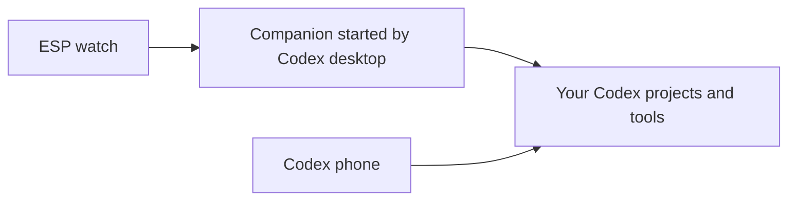

# ESP voice and Codex access

The ESP listener previously started an independent Codex process outside the
Mac app. That process could read ordinary files but did not receive the desktop
app's project and task tools. The phone's native voice chat did receive them.

The installer now registers a small companion that Codex desktop starts itself.
The listener connects to it, and it starts the voice process with the desktop's
app connection, configured tools, account and permissions. Codex desktop must be
open. The companion exposes no model tools and disables itself in voice children
so it cannot start recursively. Its connection folder and sockets are private to
the current Mac user; startup messages are bounded and validated.

## Checked

| Capability | Result |
| --- | --- |
| Desktop app tools | All 53 installed native app tools were discovered through the new connection. |
| Project discovery and task creation | A saved voice-owned chat called the real `list_projects`, found Instagram page, and used `create_thread` to create a local task there. The new task finished with `hi`. |
| Configured tools and plugins | Configuration is inherited. Optional per-machine exclusions still apply; discovery alone does not prove every external account is signed in. |
| Reasoning | Watch choice, then ESP environment preference, then Codex configuration, then low. Model selection is independent. Unsupported combinations fail clearly. |
| New and resumed reasoning | The installed Codex returned `high` for both a newly opened chat and a resumed saved voice chat, with its global preference set to `low`. |
| Saved watch preference | Firmware sender check compiles the actual offer function and confirms each level is sent for new and resumed calls; Default sends no override. Firmware has a separate companion PR. |
| Permissions | Inherited from Codex. The desktop display uses the settings actually returned by Codex instead of claiming every chat has Full Access. |
| Required approvals and questions | Preserved as pending requests, with validated answers routed back from the Codex chat. The device says to answer in Codex. Previously the service declined approvals or supplied empty answers automatically. |
| Account choice | Removed the ESP-only instruction to search every inbox automatically; normal configured instructions and tool requirements apply. |
| Host transport and failures | Runnable checks cover messages, invalid startup data, companion restart, and rejecting publicly accessible sockets. |

## Remaining differences

This change does not establish complete phone/desktop parity:

- Temporary chats are not loaded in the desktop app, and native app tool calls
  from them can fail with missing caller context. Saved voice chats are verified.
  The service must report failures honestly, not infer that a project is absent.
- The watch does not yet display individual approval/question controls. Answer
  those in the saved voice chat on phone/desktop. A future watch control should
  show the action and send a reply tied to its exact request, without changing
  account-wide permissions.
- The desktop follower connection supports history and pending question replies;
  arbitrary desktop editing, steering, and settings changes during an active
  device call are not implemented by this bridge.
- Available tools are shared, but a watch cannot render desktop panels, browser
  tabs, uploaded files, or every rich output. Tool availability is not proof that
  each visual workflow can be completed on the watch.
- Physical microphone, speaker, and touch behavior with this change still need a
  fresh device call. Host checks do not prove audible playback or a firmware flash.

## Validation

Server: `bun run check`. Firmware sender:
`python3 scripts/tests/test_voice_reasoning.py` after firmware dependencies are
available. `CJSON_SOURCE` can point to an existing cJSON component checkout and
`CXXFLAGS` can select the local host compiler's SDK.
